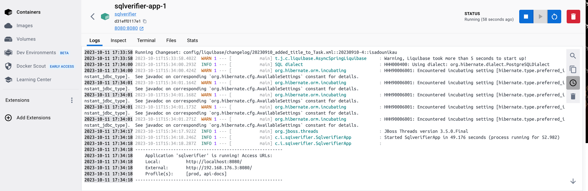

# Sql Verifier

## Project Structure

Node is required for generation and recommended for development. `package.json` is always generated for a better development experience with prettier, commit hooks, scripts and so on.

- `/src/*` structure follows default Java structure.
- `npmw` - wrapper to use locally installed npm.
- `/src/main/docker` - Docker configurations for the application and services that the application depends on

## Development

Before you can build this project, you must install and configure the following dependencies on your machine:

1. We need to install required development programs
   1. Java. System uses Java 17 and therefore we need to install it to local machine
      1. **Windows** users should follow [Downloading the JDK Installer](https://docs.oracle.com/en/java/javase/17/install/installation-jdk-microsoft-windows-platforms.html#GUID-371F38CC-248F-49EC-BB9C-C37FC89E52A0) instructions
      2. **MacOS** can user [brew](https://formulae.brew.sh/formula/openjdk@17) or any other preferable tool
      3. **Linux** based users can use next command `apt install openjdk-17-jdk openjdk-17-jre`
   2. [Docker](https://docs.docker.com/desktop/) is containerisation tool, we use it for local database. 
   The tool is easy to use and it has user-friendly interface 
      1. [Windows](https://docs.docker.com/desktop/install/windows-install/) install
      2. [MacOS](https://docs.docker.com/desktop/install/mac-install/) install
      3. [Linux](https://docs.docker.com/desktop/install/linux-install/) install
2. [Node.js][]: We use Node to run a development web server and build the project.
   Depending on your system, you can install Node either from source or as a pre-packaged bundle.

After installing Node, you should be able to run the following command to install development tools.
You will only need to run this command when dependencies change in [package.json](package.json).

```
npm install
```

We use npm scripts and [Webpack][] as our build system.

Run the following commands generate application image and allows to run it at the local environment.

```
npm run java:docker
docker compose -f src/main/docker/app.yml up -d
```
Docker should show next containers initialisation after second command execution

You should be able to enter any container logs. And observe healthiness of application inside of `app-1`

The last script runs application in background, therefore it finishes fast, even application is not fully started.
You should be able to observe application logs in Docker Desctop and application startup finishes with next logs
----------------------------------------------------------
        Application 'sqlverifier' is running! Access URLs:
        Local:          http://localhost:8080/
        Profile(s):     [dev, api-docs]
---------------------------------------------------------- 

Now you should be able to open application by accessing http://localhost:8080/ 

## Testing

To launch your application's tests, run:

```
./gradlew test integrationTest jacocoTestReport
```

### Client tests

Unit tests are run by [Jest][]. They're located in [src/test/javascript/](src/test/javascript/) and can be run with:

```
npm test
```

## Using Docker to simplify development (optional)

You can use Docker to improve your JHipster development experience. A number of docker-compose configuration are available in the [src/main/docker](src/main/docker) folder to launch required third party services.

For example, to start a postgresql database in a docker container, run:

```
docker compose -f src/main/docker/postgresql.yml up -d
```

To stop it and remove the container, run:

```
docker compose -f src/main/docker/postgresql.yml down
```

You can also fully dockerize your application and all the services that it depends on.
To achieve this, first build a docker image of your app by running:

```
npm run java:docker
```

Or build a arm64 docker image when using an arm64 processor os like MacOS with M1 processor family running:

```
npm run java:docker:arm64
```

Then run:

```
docker compose -f src/main/docker/app.yml up -d
```

When running Docker Desktop on MacOS Big Sur or later, consider enabling experimental `Use the new Virtualization framework` for better processing performance ([disk access performance is worse](https://github.com/docker/roadmap/issues/7)).

[Node.js]: https://nodejs.org/
[NPM]: https://www.npmjs.com/
[Webpack]: https://webpack.github.io/
[BrowserSync]: https://www.browsersync.io/
[Jest]: https://facebook.github.io/jest/
[Leaflet]: https://leafletjs.com/
[DefinitelyTyped]: https://definitelytyped.org/
